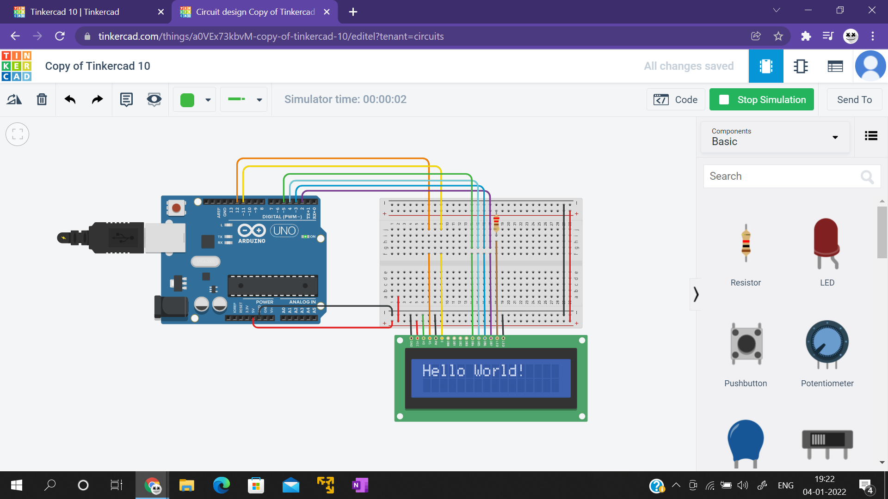
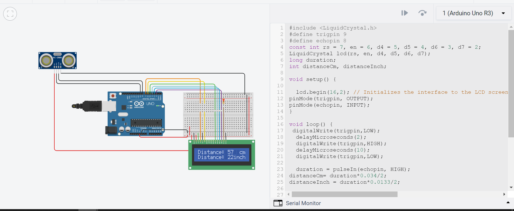

# Mini Arduino Projects

```tut1.cpp```
Printing Hello World on LCD using Arduino :)

```tut1.cpp```
Measuring distance using Ultrasonic distance sensor on LCD using Arduino

## Screenshots
```tut1.cpp```



```tut2.cpp```


## Authors

- [@anukulpandey](https://www.github.com/anukulpandey)

  